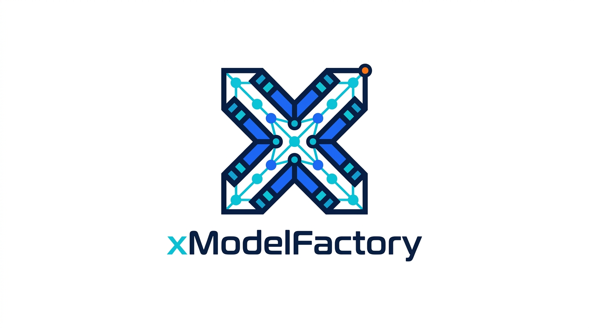

<p align="center">
  
</p>

<h1 align="center">xModelFactory</h1>

<p align="center">
  A production-ready training framework for Large Language Models (LLM) and Vision Language Models (VLM).
</p>

<p align="center">
  <a href="https://www.python.org/downloads/">
    
  </a>
  <a href="https://pytorch.org/">
    
  </a>
  <a href="LICENSE">
    
  </a>
</p>

<p align="center">
  <a href="#features">Features</a> •
  <a href="#installation">Installation</a> •
  <a href="#quick-start">Quick Start</a> •
  <a href="#training-examples">Examples</a> •
  <a href="#documentation">Documentation</a> •
  <a href="#testing">Testing</a>
</p>

<p align="center">
  Modular training stages, multi-GPU execution, and production-friendly tooling for scalable model development.
</p>

## Features

- **Multiple Training Stages**: Pre-training, Supervised Fine-Tuning (SFT), Direct Preference Optimization (DPO), Proximal Policy Optimization (PPO), Group Relative Policy Optimization (GRPO)
- **Multi-GPU Support**: DeepSpeed (ZeRO-0/1/2/3), PyTorch DDP, Single GPU
- **Flexible Configuration**: Intuitive dataclass-based configuration system
- **Production Ready**: Built for real-world deployment with checkpointing, logging, and evaluation
- **Vision Support**: First-class support for Vision-Language models

## Installation

### From Source

```bash
git clone https://github.com/yourusername/xModelFactory.git
cd xModelFactory
pip install -e .
```

### With Optional Dependencies

```bash
# With DeepSpeed support
pip install -e ".[deepspeed]"

# With all optional dependencies
pip install -e ".[all]"
```

## Quick Start

### 1. Pre-training

```python
from xmodel_factory import ModelConfig, TrainConfig, Trainer

# Configure model
model_config = ModelConfig(
    vocab_size=32000,
    hidden_size=4096,
    num_hidden_layers=32,
    num_attention_heads=32,
)

# Configure training
train_config = TrainConfig(
    n_epochs=3,
    batch_size=4,
    model_config=model_config,
)

# Train
trainer = Trainer(
    train_config=train_config,
    eval_prompts=["Hello, world!"]
)
trainer.train()
```

### 2. Multi-GPU Training

```bash
# Automatic selection (recommended)
smart_train train.py

# Force DeepSpeed
ds_train train.py

# Force DDP
ddp_train train.py

# Single GPU
py_train train.py
```

### 3. Check GPU Setup

```bash
python examples/check_gpu.py
```

## Project Structure

```
xModelFactory/
├── xmodel_factory/          # Main package
│   ├── model_core/          # Model definitions
│   │   ├── __init__.py
│   │   └── attention_masks.py
│   └── train_core/          # Training framework
│       ├── __init__.py
│       ├── base_trainer.py
│       ├── trainer.py       # Pre-training
│       ├── sft_trainer.py   # SFT
│       ├── dpo_trainer.py   # DPO
│       ├── ppo_trainer.py   # PPO
│       ├── grpo_trainer.py  # GRPO
│       ├── train_configs.py
│       ├── parallel.py      # Multi-GPU support
│       └── tools.py
├── examples/                # Example scripts
│   ├── check_gpu.py
│   ├── simple_pretrain.py
│   ├── simple_sft.py
│   ├── simple_dpo.py
│   └── simple_grpo.py
├── scripts/                 # Training launchers
│   ├── smart_train
│   ├── ds_train
│   ├── ddp_train
│   └── py_train
├── tests/                   # Unit tests
├── docs/                    # Documentation
├── setup.py
├── pyproject.toml
├── requirements.txt
└── README.md
```

## Training Examples

### Pre-training

```python
from xmodel_factory import ModelConfig, TrainConfig, Trainer

model_config = ModelConfig(vocab_size=32000, hidden_size=512, num_hidden_layers=4)
train_config = TrainConfig(n_epochs=2, batch_size=4, model_config=model_config)

trainer = Trainer(train_config=train_config, eval_prompts=["Test"])
trainer.train()
```

### SFT (Supervised Fine-Tuning)

```python
from xmodel_factory import SFTTrainer, SFTConfig

train_config.sft_config = SFTConfig(mask_prompt=True)
trainer = SFTTrainer(train_config=train_config, eval_prompts=["Instruction: ..."])
trainer.train()
```

### DPO (Direct Preference Optimization)

```python
from xmodel_factory import DPOTrainer, DPOConfig

train_config.dpo_config = DPOConfig(loss_beta=0.1)
trainer = DPOTrainer(train_config=train_config, eval_prompts=["Prompt"])
trainer.train()
```

### GRPO (Group Relative Policy Optimization)

```python
from xmodel_factory import GRPOTrainer, GRPOConfig

def reward_func(prompts, completions, answers):
    return [1.0 if "correct" in c else 0.0 for c in completions]

train_config.grpo_config = GRPOConfig(group_size=12)
trainer = GRPOTrainer(
    train_config=train_config,
    reward_func=reward_func,
    eval_prompts=["Question: ..."]
)
trainer.train()
```

## Multi-GPU Training

### Automatic Selection

The `smart_train` script automatically selects the best parallel strategy:

```bash
smart_train examples/simple_pretrain.py
```

Priority:
1. DeepSpeed (if installed)
2. PyTorch DDP (if multiple GPUs available)
3. Single GPU/CPU (fallback)

### Manual Selection

```bash
# DeepSpeed with ZeRO-3
ds_train train.py

# PyTorch DDP
ddp_train train.py

# Single device
py_train train.py
```

### Environment Variables

```bash
# Set parallel type manually
export PARALLEL_TYPE=ds  # ds, ddp, or none

# DeepSpeed specific
export TOKEN_DIR=/path/to/tokenizer
export LOG_DIR=/path/to/logs
```

## Configuration

### Model Configuration

```python
from xmodel_factory import ModelConfig

config = ModelConfig(
    vocab_size=32000,
    hidden_size=4096,
    num_hidden_layers=32,
    num_attention_heads=32,
    intermediate_size=11008,
    max_position_embeddings=4096,
)
```

### DeepSpeed Configuration

```python
from xmodel_factory import DsConfig, DsZero2Config, DsZero3Config

# ZeRO-2
ds_config = DsConfig(zero_config=DsZero2Config())

# ZeRO-3 with offload
ds_config = DsConfig(
    zero_config=DsZero3Config(
        offload_optimizer=DsOffloadConfig(device='cpu'),
        offload_param=DsOffloadConfig(device='cpu'),
    )
)
```

## Testing

```bash
# Run all tests
pytest tests/

# Run specific test
pytest tests/test_trainer.py

# Check GPU setup
python examples/check_gpu.py
```

## Documentation

- [Quick Start Guide](docs/quickstart.md)
- [Training Guide](docs/training.md)
- [Multi-GPU Training](docs/multi_gpu.md)
- [API Reference](docs/api.md)

## Requirements

- Python >= 3.8
- PyTorch >= 2.0.0
- CUDA >= 11.7 (for GPU support)

Optional:
- DeepSpeed >= 0.12.0 (for distributed training)
- lion-pytorch >= 0.1.0 (for Lion optimizer)

## Contributing

We welcome contributions! Please see [CONTRIBUTING.md](CONTRIBUTING.md) for guidelines.

## License

This project is licensed under the MIT License - see the [LICENSE](LICENSE) file for details.

## Citation

If you use xModelFactory in your research, please cite:

```bibtex
@software{xmodelfactory2024,
  title={xModelFactory: A Comprehensive Training Framework for LLM and VLM},
  author={xModelFactory Team},
  year={2024},
  url={https://github.com/yourusername/xModelFactory}
}
```

## Acknowledgments

- Built on [PyTorch](https://pytorch.org/)
- Distributed training powered by [DeepSpeed](https://www.deepspeed.ai/)
- Inspired by [Hugging Face Transformers](https://huggingface.co/docs/transformers)

